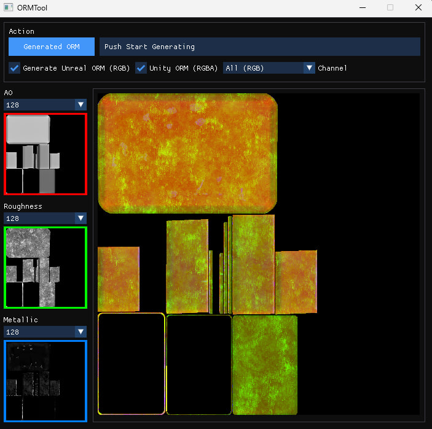

# ORMTool

**ORMTool** is a lightweight C++ desktop application that generates ORM (Occlusion-Roughness-Metallic) texture maps by combining separate grayscale images. It provides real-time previews, supports both Unreal Engine and Unity formats, and uses a modern GUI built with Dear ImGui.

---

## 🛠 Features

- ✅ Generate ORM textures for:
  - **Unreal Engine** format: AO (R), Roughness (G), Metallic (B)
  - **Unity** format: Metallic (R), AO (G), White (B), Inverted Roughness (A)
- ✅ Preview textures and individual color channels
- ✅ Live progress bar during generation
- ✅ Support for custom resolutions
- ✅ Fast multithreaded image processing
- ✅ Simple drag-and-drop style UI using ImGui

---

## 📷 Screenshot

`

---

## 🧱 Dependencies

The project requires the following libraries:

- [GLFW](https://www.glfw.org/) — window/context/input
- [OpenGL](https://www.opengl.org/) — rendering backend
- [Dear ImGui](https://github.com/ocornut/imgui) — GUI
- [stb_image.h / stb_image_write.h](https://github.com/nothings/stb) — image I/O
- [Native File Dialog (NFD)](https://github.com/mlabbe/nativefiledialog) — file picker

---
